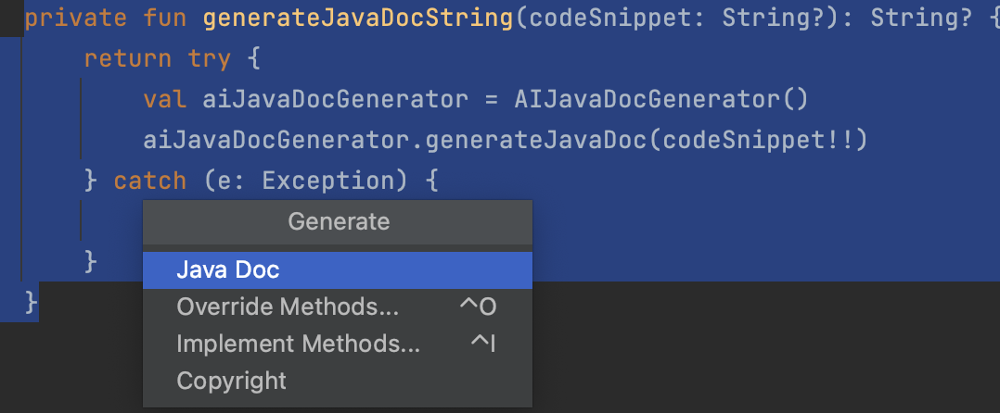

# JavaDoc Generator IntelliJ Plugin

The JavaDoc Generator IntelliJ Plugin is a plugin for IntelliJ IDEA that simplifies the process of generating JavaDoc comments for methods. It allows you to copy a method and then right-click to generate the corresponding JavaDoc comment automatically.

## Features

- Easy method JavaDoc generation: Copy a method and right-click to generate a JavaDoc comment.
- Streamlined workflow: Quickly add method documentation without manual typing.

## Installation

- Using the IDE built-in plugin system:

  <kbd>Settings/Preferences</kbd> > <kbd>Plugins</kbd> > <kbd>Marketplace</kbd> > <kbd>Search for "javadoc-generator"</kbd> >
  <kbd>Install</kbd>

- Manually:

  Download the [latest release](https://github.com/mraghurao92/javadoc-generator/releases/latest) and install it manually using
  <kbd>Settings/Preferences</kbd> > <kbd>Plugins</kbd> > <kbd>⚙️</kbd> > <kbd>Install plugin from disk...</kbd>

## Usage

1. Copy a method in your source code.
2. Right-click in the code editor.
3. Select `Generate JavaDoc` from the context menu.
4. The JavaDoc comment for the copied method will be generated and inserted.

## Demo

## Feedback and Contributions

If you encounter any issues, have suggestions, or would like to contribute, please feel free to open an issue or submit a pull request on the GitHub repository: [Link to GitHub Repository](https://github.com/mraghurao92/javadoc-generator.git).

